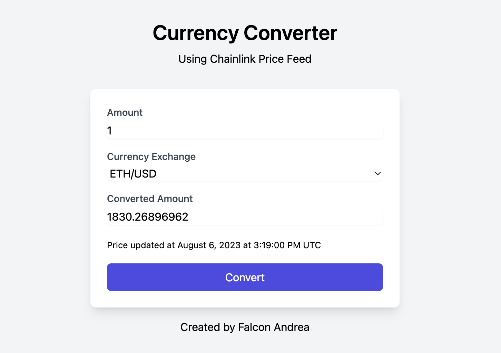

# Simple Currency Converter with ChainLink

This is a simple web application that uses Chainlink Data Feeds to fetch exchange rates between different currencies. It allows you to convert a value from one currency to another.



## How It Works

1. The web application uses Chainlink Data Feeds to fetch exchange rates between different currencies.

2. Insert the amount and select the currency exchange from the dropdown.

3. Click on Convert button.

4. The equivalent value will be automatically displayed below the input fields.

5. The conversion is done on-chain using the smart contract deployed on the Sepolia network.

```shell
# Install packages
npm install

# Compile contracts
npx hardhat compile

# Launch tests
npx hardhat test

# Run script deploy (it prints the CONTRACT_ADDRESS to use in frontend)
npx hardhat run scripts/deploy.js --network sepolia

# Verify the contract
npx hardhat verify --network sepolia CONTRACT_ADDRESS

# Install frontend packages in local
cd frontend && npm install

# Create .env file with the CONTRACT_ADDRESS and run the app
npm run dev
```
